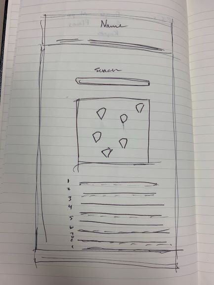

# whereabounds app
Deployed at: https://ehammons.github.io/whereabounds/

## Group members:
* Elise Hammons: https://github.com/EHammons
* Kristen Stroup: https://github.com/Knwhit20
* Aaron Phillips: https://github.com/aaronphillips929
* Christopher Mlinac: https://github.com/cmlinac
> Web app for displaying user-submitted city details including weather, maps, places and more.

## Table of contents
* [Group Members](#group-members)
* [General info](#general-info)
* [Tasks](#original-task-breakdown)
* [Screenshots](#screenshots)
* [Technologies](#technologies)
* [Setup](#setup)
* [Features](#features)
* [Status](#status)
* [Inspiration](#inspiration)
* [Contact](#contact)

## General info
Created for a coding class project, all group members have collaborated to create a working, useful all-in-one app to give a user information about their selected city.

## Original Task Breakdown
* Elise: Write jQuery to display API Data
* Kristen: Implement Weather API
* Aaron: Implement Google APIs
* Christopher: Make basic HTML Wireframe

## Screenshots

## Technologies
* Weatherbit API - v2.0
* Google Places API
* Google Maps API
* jQuery
* JavaScript

## Setup
Deployed at: https://ehammons.github.io/whereabounds/

## Code Examples
Show examples of usage:
`put-your-code-here`

## Features
List of features ready and TODOs for future development
* User input city results in:
* Five day weather forecast
* FIve places to visit

## Status
Project is: _finished_ and submitted for Project 1.

## Inspiration
Project created for The Coding Bootcamp at UT Austin.

## Contact
Created by [Group Members](#group-members)
