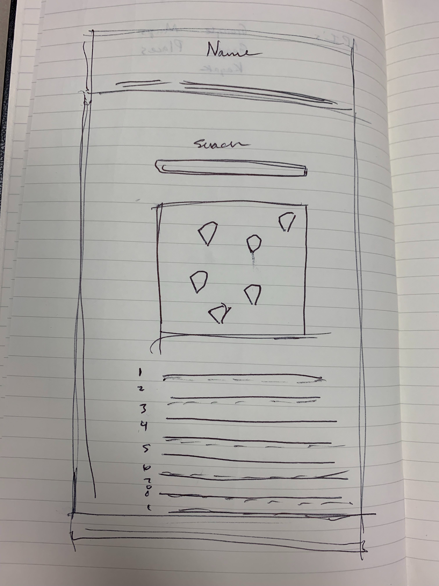

# whereabounds app
Deployed at: https://ehammons.github.io/Project-One/

## Group members:
* Elise Hammons: https://github.com/EHammons
* Kristen Stroup: https://github.com/Knwhit20
* Aaron Phillips: https://github.com/aaronphillips929
* Christopher Mlinac: https://github.com/cmlinac
> Web app for displaying user-submitted city details including weather, maps, places and more.

## Table of contents
* [General info](#general-info)
* [Screenshots](#screenshots)
* [Technologies](#technologies)
* [Setup](#setup)
* [Features](#features)
* [Status](#status)
* [Inspiration](#inspiration)
* [Contact](#contact)

## General info
Created for a coding class project, all group members have collaborated to create a working, useful all-in-one app to give a user information about their selected city.

## Screenshots

## Technologies
* Weatherbit API - v2.0
* Google Places API
* Google Maps API
* jQuery
* JavaScript

## Setup
Describe how to install / setup your local environement / add link to demo version.

## Code Examples
Show examples of usage:
`put-your-code-here`

## Features
List of features ready and TODOs for future development
* Awesome feature 1
* Awesome feature 2
* Awesome feature 3

To-do list:
* Wow improvement to be done 1
* Wow improvement to be done 2

## Status
Project is: _in progress_, _finished_, _no longer continue_ and why?

## Inspiration
Add here credits. Project inspired by..., based on...

## Contact
Created by [@flynerdpl](https://www.flynerd.pl/) - feel free to contact me!